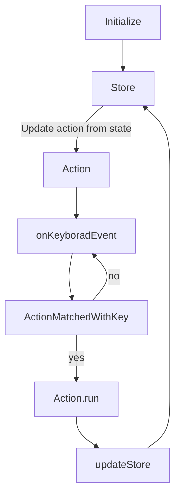
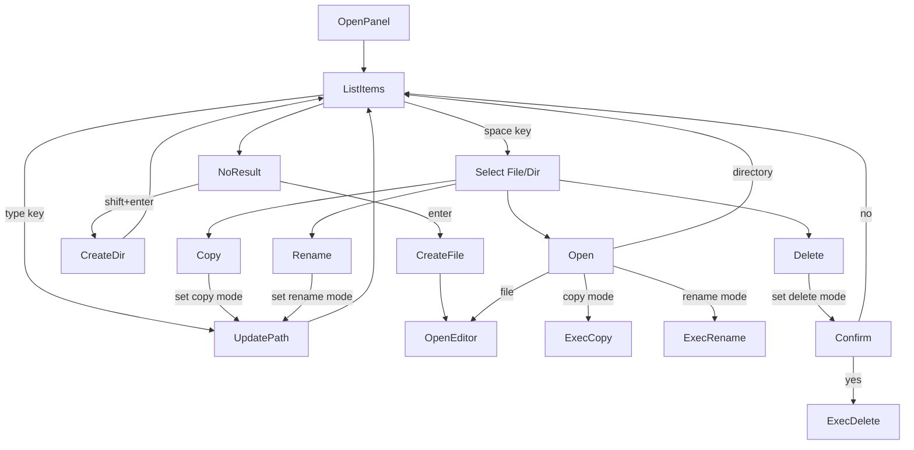
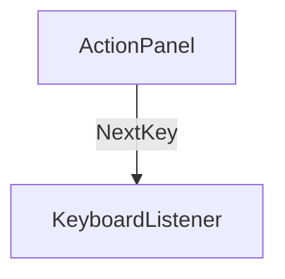

## Extensionの作成

```bash
npm run vscode:package
```

## Extensionのインストール

```
code --force --install-extension incremental-filer-0.1.1.vsix
```

## 設計

### 状態



### コピーの仕様

| コピー元             | コピー先         | 結果                   |
| -------------------- | ---------------- | ---------------------- |
| 単一既存ファイル     | 既存ファイル     | 上書きコピー           |
| 単一既存ファイル     | 既存ディレクトリ | エラー                 |
| 単一既存ファイル     | ドット           | ディレクトリ内にコピー |
| 単一既存ディレクトリ | 既存ファイル     | エラー                 |
| 単一既存ディレクトリ | 既存ディレクトリ | エラー                 |
| 単一既存ディレクトリ | ドット           | ディレクトリ内にコピー |
| 複数既存ファイル     | 既存ファイル     | エラー                 |
| 複数既存ファイル     | 既存ディレクトリ | エラー                 |
| 複数既存ファイル     | ドット           | ディレクトリ内にコピー |
| 複数既存ディレクトリ | 既存ファイル     | エラー                 |
| 複数既存ディレクトリ | 既存ディレクトリ | エラー                 |
| 複数既存ディレクトリ | ドット           | ディレクトリ内にコピー |

### 移動の仕様

| コピー元             | コピー先         | 結果                 |
| -------------------- | ---------------- | -------------------- |
| 単一既存ファイル     | 既存ファイル     | 上書き移動           |
| 単一既存ファイル     | 既存ディレクトリ | エラー               |
| 単一既存ファイル     | ドット           | ディレクトリ内に移動 |
| 単一既存ディレクトリ | 既存ファイル     | エラー               |
| 単一既存ディレクトリ | 既存ディレクトリ | エラー               |
| 単一既存ディレクトリ | ドット           | ディレクトリ内に移動 |
| 複数既存ファイル     | 既存ファイル     | エラー               |
| 複数既存ファイル     | 既存ディレクトリ | エラー               |
| 複数既存ファイル     | ドット           | ディレクトリ内に移動 |
| 複数既存ディレクトリ | 既存ファイル     | エラー               |
| 複数既存ディレクトリ | 既存ディレクトリ | エラー               |
| 複数既存ディレクトリ | ドット           | ディレクトリ内に移動 |

## UI 設計

色々なインクリメンタル検索に利用できるように汎用的に設計する。

```js
type Props<Item> = Readonly<{
    items: ReadonlyArray<Item>;
    searchWord: string
    selectedComponent: {};
    searchHint: {}
    statusBar: {}
    dialog: {}
    searchBox: {
        onChange: (word) => void
        onKeyboardPress: (key) => void
    },
    itemList: {
        onKeyboardPress: (key) => void
        item: {
            onClick: () => void
        }
    }
}>;
const IncrementalSearchPanel = <Item>(props: Props<Item>): React.ReactElement
```

### 状態

- 検索語
- Array<item>
- 選択されているView: SearchBox or ItemList
- 選択されているItemのindex
- SearchBoxのカーソルの位置
- StatusMessage: 下部のメッセージ
- SearchHint: 検索ボックス上部のメッセージ
- Dialog

### Action

- フォーカスされているコンポーネントに応じて実行できるアクションが生成される
- １つのアクションにはキーごと実行可能なコマンドが登録されている
- ShortcutHelpにActionに登録されているキーと説明を表示する
- 各コンポーネントのonKeyPress内で`action.run(key)`を実行する

### SearchBox

- 入力
  - 検索ワード
- onChange: 入力のたびに検索を実施
  - 入力: 検索ワード, Array<Item>
  - 出力: 新しいArray<Item>
- キーボード: onKeyPress
  - フォーカス時のみ

### ItemList

- 入力
  - Array<Item>
- Item要素: 要件によって自由に設計できるようにする
  - Checkbox
  - アイコン
  - Item名
  - Item情報
- Item.onClick: Itemの選択
- カーソル移動によるスクロール
- キーボード: Item.onKeyPress
  - フォーカス時のみ
  - 上下キー: Itemの移動
  - エンターキー: Itemの選択
  - その他のキー: 要件によって自由に選択

### ShortcutHelp

### Status

- 要件
  - 普通の情報は下部のステータスバーに表示する(Status)
  - エラーはエラーダイアログを表示(ErrorMode)
  - コピー、リネームモード時のパスは検索ボックスの上部に表示(CopyMode, RenameMode)
  - 削除確認はダイアログ(ConfirmMode)

## Action Flow



## Actionパネルの選択肢

| Active Element | Condition                | Actions                       |
| :------------- | :----------------------- | :---------------------------- |
| Query Box      | Dir or File              | -                             |
| Query Box      | (Dir or File) and Copy   | ExecCopy(Overwrite)           |
| Query Box      | (Dir or File) and Rename | ExecRename(Overwrite)         |
| Query Box      | NoItem                   | CreateFile, CreateDir         |
| Query Box      | NoItem and Copy          | CreateDir, ExecCopy           |
| Query Box      | NoItem and Rename        | CreateDir, ExecRename         |
| Item Selector  | File or Dir              | Open, Copy, Rename, Delete    |
| Item Selector  | Copy and File            | ExecCopy(Overwrite)           |
| Item Selector  | Copy and Dir             | OpenDir, ExecCopy(Overwrite)  |
| Item Selector  | Rename and File          | ExecRename(Overwrite)         |
| Item Selector  | Rename and Dir           | OpenDir, ExecRename(Overwite) |

- `Overwrite`の時は確認画面を表示する

## 状態の種類

|        |                                |
| :----- | :----------------------------- |
| Copy   | Copy先のItemを決定するモード   |
| Rename | Rename先のItemを決定するモード |

## Next Key



```
type NextKey = Readonly<{
  modifierKeys: ReadonlyArray<Shift | Meta | Alt | Ctrl>;
  key: string;
}>;
```
