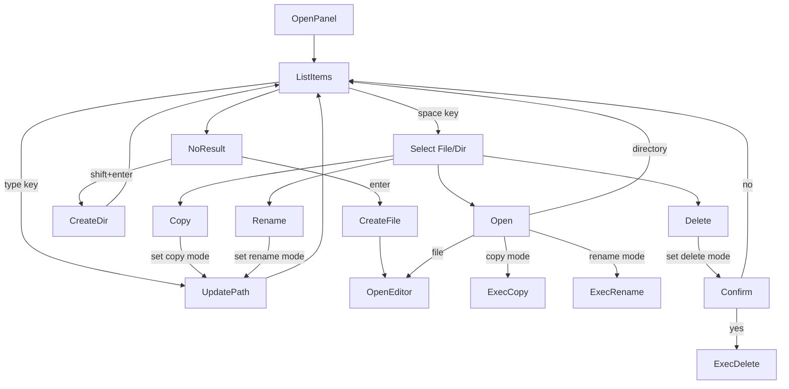
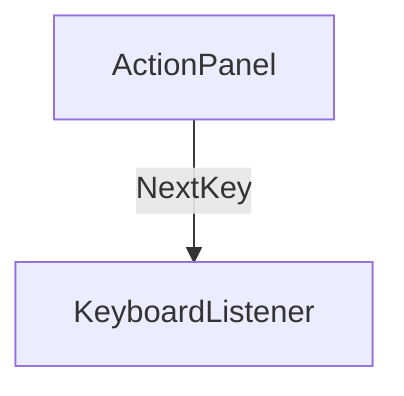

## Action Flow



## Actionパネルの選択肢

| Active Element | Condition                | Actions                       |
| :------------- | :----------------------- | :---------------------------- |
| Query Box      | Dir or File              | -                             |
| Query Box      | (Dir or File) and Copy   | ExecCopy(Overwrite)           |
| Query Box      | (Dir or File) and Rename | ExecRename(Overwrite)         |
| Query Box      | NoItem                   | CreateFile, CreateDir         |
| Query Box      | NoItem and Copy          | CreateDir, ExecCopy           |
| Query Box      | NoItem and Rename        | CreateDir, ExecRename         |
| Item Selector  | File or Dir              | Open, Copy, Rename, Delete    |
| Item Selector  | Copy and File            | ExecCopy(Overwrite)           |
| Item Selector  | Copy and Dir             | OpenDir, ExecCopy(Overwrite)  |
| Item Selector  | Rename and File          | ExecRename(Overwrite)         |
| Item Selector  | Rename and Dir           | OpenDir, ExecRename(Overwite) |

- `Overwrite`の時は確認画面を表示する

## 状態の種類

|        |                                |
| :----- | :----------------------------- |
| Copy   | Copy先のItemを決定するモード   |
| Rename | Rename先のItemを決定するモード |

## Next Key



```
type NextKey = Readonly<{
  modifierKeys: ReadonlyArray<Shift | Meta | Alt | Ctrl>;
  key: string;
}>;
```
